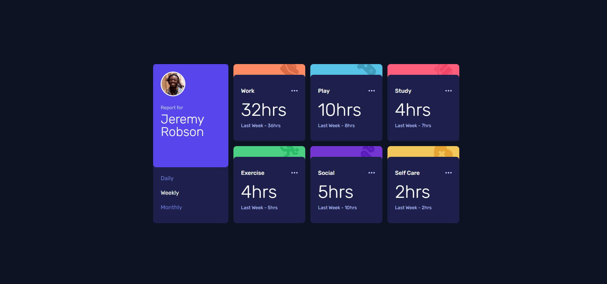

# Frontend Mentor - Time tracking dashboard solution

This is a solution to the [Time tracking dashboard challenge on Frontend Mentor](https://www.frontendmentor.io/challenges/time-tracking-dashboard-UIQ7167Jw). Frontend Mentor challenges help you improve your coding skills by building realistic projects.

## Table of contents

- [Frontend Mentor - Time tracking dashboard solution](#frontend-mentor---time-tracking-dashboard-solution)
  - [Table of contents](#table-of-contents)
  - [Overview](#overview)
    - [The challenge](#the-challenge)
    - [Screenshot](#screenshot)
    - [Links](#links)
  - [My process](#my-process)
    - [Built with](#built-with)
    - [What I learned](#what-i-learned)
      - [CSS](#css)
      - [Javascript](#javascript)
    - [Continued development](#continued-development)
    - [AI Collaboration](#ai-collaboration)
  - [Author](#author)

**Note: Delete this note and update the table of contents based on what sections you keep.**

## Overview

### The challenge

Users should be able to:

- View the optimal layout for the site depending on their device's screen size
- See hover states for all interactive elements on the page
- Switch between viewing Daily, Weekly, and Monthly stats

### Screenshot

### Links

- Solution URL: [Frontendmentor](https://www.frontendmentor.io/solutions/time-tracking-dashboard-with-vanilla-javascript-and-sass-FJALg5JGnw)
- Live Site URL: [Netlify](https://radiant-daifuku-5db4a5.netlify.app/)

## My process

### Built with

- Semantic HTML5 markup
- Flexbox
- CSS Grid
- Mobile-first workflow
- Sass

**Note: These are just examples. Delete this note and replace the list above with your own choices**

### What I learned

#### CSS

- Setting `grid-template-rows` using percentages for specific grid items.
- Positioning the banner at the bottom of a card using `position: relative` and `z-index: -1`.
- Using `object-fit` to prevent images from stretching.
- Using `rem` in media queries to ensure the layout stays responsive when users change their default font size.
- Using SCSS variables and mixins to keep styles consistent and reusable.

#### Javascript

- Fetching data from a JSON file using the fetch() function.
- Populating the DOM by looping through data and appending elements.
- Creating HTML elements dynamically with document.createElement().
- Using template literals inside innerHTML to build markup.
- Updating and re-rendering the UI when a user clicks a time period (Daily, Weekly, Monthly).

### Continued development

I want to practice working with data more — things like:

- Using filter() and other array methods
- Using data attributes in HTML
- Manipulating the DOM more efficiently

### AI Collaboration

I use Deepseek inside github copilot to ask the step to implement update data then rerender

## Author

- Frontend Mentor - [@Odiesta](https://www.frontendmentor.io/profile/Odiesta)
- X - [@OdiestaS](https://www.x.com/OdiestaS)
